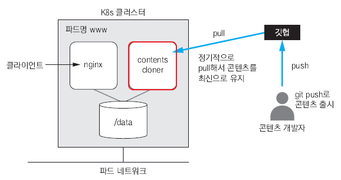
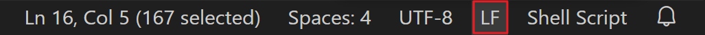
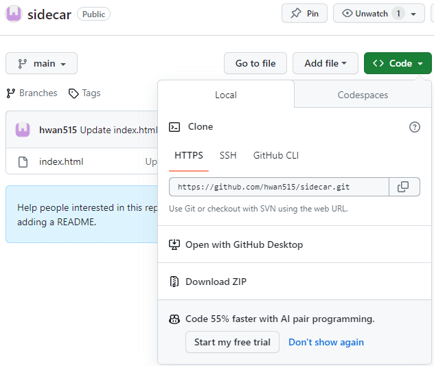
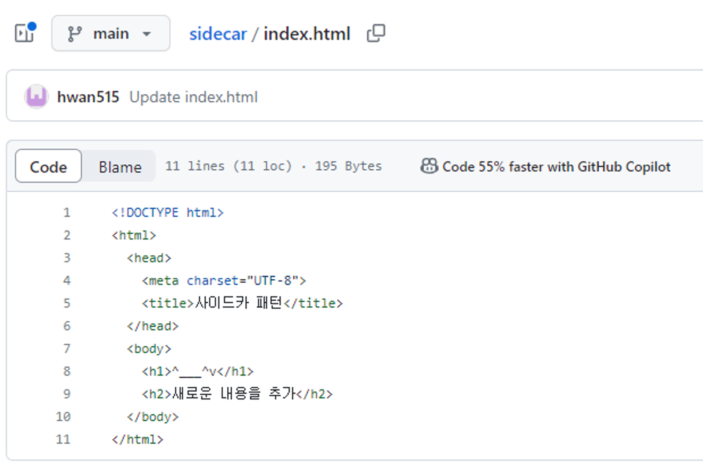

# sidecar 패턴으로 파드 구성

# **사이드카 패턴**



하나의 파드에 웹 서버 컨테이너와 깃허브에서 최신 컨텐츠를 다운받는 컨테이너를 조합

## #1 **깃 허브에서 정기적으로 컨텐츠를 다운받는 쉘 스크립트를 작성**

```bash
C:\kubernetes> mkdir sidecar

C:\kubernetes> cd sidecar

C:\kubernetes\sidecar> code contents-cloner
```

## #2 **contents-cloner에 아래 내용을 작성**

```bash
#!/bin/bash

if [ -z $CONTENTS_SOURCE_URL ]; then
    exit 1
fi

git clone $CONTENTS_SOURCE_URL /data

cd /data

while true
do
    date
    sleep 60
    git pull
done
```

스크립트는 주어진 환경 변수 `$CONTENTS_SOURCE_URL`에 지정된 Git 저장소에서 컨텐츠를 복제하고 주기적으로 업데이트를 가져오는 작업을 수행합니다.

스크립트의 각 부분을 해석해 보겠습니다:

1. **`if [ -z $CONTENTS_SOURCE_URL ]; then exit 1; fi`**: 이 줄은 `$CONTENTS_SOURCE_URL` 환경 변수가 비어있는지 확인하고, 비어있다면 스크립트를 종료합니다(exit 1).
2. **`git clone $CONTENTS_SOURCE_URL /data`**: `$CONTENTS_SOURCE_URL`에 지정된 Git 저장소를 `/data` 디렉터리에 복제합니다.
3. **`cd /data`**: `/data` 디렉터리로 이동합니다.
4. **`while true; do ... done`**: 이 부분은 무한 루프를 나타냅니다. 루프 내부에서는 현재 날짜를 출력하고 60초(1분) 동안 대기한 다음 Git 저장소에서 최신 업데이트를 가져오기 위해 `git pull` 명령어를 실행합니다. 그런 다음 루프는 다시 처음부터 시작합니다.

스크립트를 실행하면 `$CONTENTS_SOURCE_URL`에 지정된 Git 저장소의 변경 사항이 주기적으로 확인되어 로컬 머신에 업데이트를 적용할 것입니다. 루프가 무한하게 실행되므로 스크립트를 종료하려면 명시적으로 중단해야 합니다. 일반적으로 이 스크립트는 백그라운드에서 실행되어 지속적으로 업데이트를 받아오는 작업을 처리할 때 사용될 수 있습니다.

**아래 문자열 코드를 LF로 수정하기**



## #3 **Dockerfile 작성**

```docker
FROM    ubuntu:latest
RUN     apt-get update  &&  apt-get install -y git
COPY    ./contents-cloner  /contents-cloner
RUN     chmod  a+x  /contents-cloner
WORKDIR /
CMD     ["/contents-cloner"]
```

## #4 **이미지 빌드 및 레지스트리에 등록**

```bash
C:\kubernetes\sidecar> docker image build --tag 본인_도커_허브_계정/contents-cloner:1.0 .

C:\kubernetes\sidecar> docker image ls
REPOSITORY                 TAG   IMAGE ID       CREATED              SIZE
myanjini/contents-cloner   1.0   d7806ba2d44c   About a minute ago   198MB

C:\kubernetes\sidecar> docker login
Authenticating with existing credentials...
Login Succeeded

C:\kubernetes\sidecar> docker image push myanjini/contents-cloner:1.0
```

## #5 **깃 허브 레포지터리 주소를 확인**



## #6 **사이드카 패턴의 파드를 생성하는 매니페스트를 작성**

`/home/vagrant/**webserver.yaml**`

```yaml
apiVersion: v1
kind: Pod
metadata:
  name: webserver
spec:
  containers:
  - name: nginx
    image: nginx
    volumeMounts:
    - mountPath: /usr/share/nginx/html
      name: contents-vol
      readOnly: true
  - name: cloner
    image: myanjini/contents-cloner:1.0
    env:
    - name: CONTENTS_SOURCE_URL
      value: "https://github.com/myanjini/sidecar.git"
    volumeMounts:
    - mountPath: /data
      name: contents-vol
  volumes:
  - name: contents-vol
    emptyDir: {}
```

```bash
root@master:/home/vagrant# kubectl apply -f webserver.yaml
pod/webserver created

root@master:/home/vagrant# kubectl get pod -o wide
NAME        READY   STATUS    RESTARTS   AGE   IP       NODE      NOMINATED NODE   READINESS GATES
webserver   0/2     Pending   0          7s    <none>   worker2   <none>           <none>
```

## #7 **Docker Desktop Kubernetes를 활용해서 테스트**

`C:\kubernetes\**webserver.yaml**`

```yaml
apiVersion: v1
kind: Pod
metadata:
  name: webserver
spec:
  containers:
  - name: nginx
    image: nginx
    volumeMounts:
    - mountPath: /usr/share/nginx/html
      name: contents-vol
      readOnly: true
  - name: cloner
    image: myanjini/contents-cloner:1.0
    env:
    - name: CONTENTS_SOURCE_URL
      value: "https://github.com/myanjini/sidecar.git"
    volumeMounts:
    - mountPath: /data
      name: contents-vol
  volumes:
  - name: contents-vol
    emptyDir: {}
```

```cpp
C:\kubernetes> k**ubectl config get-contexts**
CURRENT   NAME             CLUSTER          AUTHINFO         NAMESPACE
          docker-desktop   docker-desktop   docker-desktop
*         minikube         minikube         minikube         default

C:\kubernetes> **kubectl config use-context docker-desktop**
Switched to context "docker-desktop".

C:\kubernetes> **kubectl config get-contexts**
CURRENT   NAME             CLUSTER          AUTHINFO         NAMESPACE
*         docker-desktop   docker-desktop   docker-desktop
          minikube         minikube         minikube         default

C:\kubernetes> **kubectl apply -f webserver.yaml**
pod/webserver created

c:\kubernetes> **kubectl get pod -o wide**
NAME                         READY   STATUS    RESTARTS   AGE   IP          NODE             NOMINATED NODE   READINESS GATES
hello-k8s-75797f94b4-v8gvw   1/1     Running   0          28h   10.1.0.12   docker-desktop   <none>           <none>
webserver                    2/2     Running   0          51s   10.1.0.13   docker-desktop   <none>           <none>
```

## #8 **대화형(=임시) 파드를 기동해서 파드의 초기 컨텐츠 출력**

```cpp
c:\kubernetes>kubectl run busybox --image=busybox --restart=Never --rm -it /bin/sh
If you don't see a command prompt, try pressing enter.
/ #
/ # wget -q -O - http://10.1.0.13
<!DOCTYPE html>
<html>
<head>
  <meta charset="UTF-8">
  <title>사이드카 패턴</title>
</head>
<body>
  <h1>사이드카 패턴</h1>
  <h1>^___^v</h1>
</body>
</html>
```

## #9 **깃 허브 리포지터리의 컨텐츠를 수정하고 커밋**



## #10 **대략 1분 후 wget을 통해 수정한 내용이 반영되는지 확인**

```cpp
/ # wget -q -O - http://10.1.0.13
<!DOCTYPE html>
<html>
  <head>
    <meta charset="UTF-8">
    <title>사이드카 패턴</title>
  </head>
  <body>
    <h1>^___^v</h1>
    <h2>새로운 내용을 추가</h2>
  </body>
</html>
```
